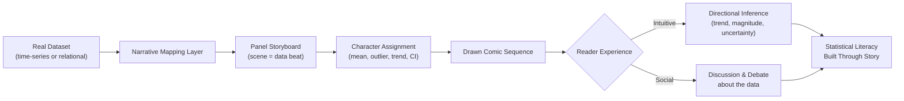

# Comics as a Stage for Statistical Analysis

# Spark Narrative

**The Observation:** Statistics are everywhere — vaccination rates, climate records, income gaps, city traffic, social media reach — yet most people never meaningfully engage with the numbers behind the headlines. The dominant presentation modes (tables, bar charts, academic abstracts) are built for specialists. For everyone else, real data remains a foreign language, translated only at the moment of crisis, when it is too late to build genuine intuition about what the numbers mean.

Meanwhile, comics — sequential panels, expressive characters, speech bubbles, and visible cause-and-effect — are among humanity's oldest tools for making sense of the world. A single panel can compress time, jump scale, and hold irony all at once. Readers follow the *logic of a panel's flow* before they consciously process its content. That is exactly the cognitive scaffolding that statistical reasoning needs.

**The Shift:** Treat comics not as a metaphor for statistics, but as a **stage** — a lit, structured performance space where real datasets walk out, play characters, and act through their own trends. Each panel is a scene. Each scene has a beat. A rising trend becomes a character gaining confidence across panels. An outlier becomes the unexpected guest that changes the drama. A confidence interval is the fog at the edge of the stage that no character can fully enter.

This is not data visualisation with a comic skin pasted on top. It is a genuine narrative architecture where:
- **The storyline is derived from the data's own temporal or structural shape** — the story is *found*, not imposed.
- **Characters are data archetypes**: the Mean as a reluctant compromise-seeker, the Outlier as the rebel with a cause, the Standard Deviation as the dramatic risk-taker, the Median as the quiet voice of the crowd.
- **Conflict is statistical**: a null hypothesis is a villain not because it is wrong, but because it refuses the evidence's invitation to be interesting.

The critical insight: when readers follow a character's arc across panels — a city's air quality index improving, then stalling, then collapsing — they are building a *mental model of a time series* without ever being told to. When they argue about whether the hero (a trend line) will "make it" before the right panel edge, they are performing informal inference.

The stage metaphor matters precisely because a stage implies **audience**: it is not a private analysis tool, it is a public venue. Comics-based statistical analysis is inherently shareable, inherently discussable, and inherently social — the same properties that make statistical literacy so hard to build in isolation, now working *in its favour*.

## Stage Ratings: Calibrating the Performance by Audience Age

Every stage has a rating — and the comics-as-stage framework must honour this. The statistical concepts a dataset carries, the visual complexity of a panel, the emotional stakes of a character's arc, and the number of panels a reader can hold in working memory all shift meaningfully across adolescence and into adulthood. This framework is scoped to readers aged **13 and above**. Two production tiers serve this range as a deliberate ladder: the M-tier builds *intuition* through pre-statistical concepts a reader can feel before they can formalise; the R-tier builds *argument* with the full machinery of statistical evidence.

| Rating | Age Band | Statistical Vocabulary | Panel Grammar | Character Complexity | Example Dataset |
|---|---|---|---|---|---|
| **M — Pre-Stats Stage** | 13–17 | Mean, median, mode; "going up / going down"; more / less than average; simple pictographs and bar reading; spotting the odd-one-out | 6–10 panels, clear cause-and-effect layout, one idea per panel, speech-bubble annotation of key numbers | Two or three characters with clear roles — the Average as steadying force, the Outlier as the disruptor, an unnamed Trend as the story's direction of travel | How many hours NZ teens spend on screens per day; local sports team scores across a season |
| **R — Evidence Stage** | 18+ | Effect size, uncertainty, p-value, multivariate interaction, confounding | Unlimited panel depth, non-linear panel order, unreliable narrators | Full ensemble with conflicting motivations; the null hypothesis is a credible antagonist with genuine sympathisers | National income inequality trends, climate attribution studies, public health intervention data |

Critically, the rating is not a content filter — it is a **production specification**. The same dataset can be staged at both tiers. A time series of national youth unemployment is a simple "the line went down, then up" comparison story at M-rating — the Outlier year gets a dramatic close-up panel, the Average grumbles in the background. At R-rating, the same series becomes a full evidence trial: what caused the shift, who bears responsibility, and what does the confidence interval actually allow us to claim? The data does not change. The stage does.

## Data Sourcing: Where the Story Comes From

The integrity of the entire framework rests on one principle: **the data must precede the narrative**. The story is found in the numbers, not written first and then decorated with figures. This places real constraints on which datasets qualify as source material, and makes data sourcing a design decision as important as illustration style or panel count.

A qualifying source must satisfy four criteria:

1. **Real and verifiable** — the dataset is publicly accessible, citable, and produced by a recognised institution. Fabricated or illustrative data defeats the literacy goal; readers must be able to follow the citation back to the source.
2. **Time-structured or comparatively structured** — the data has a natural sequential or comparative shape that maps to the panel-by-panel logic of comics. Pure cross-sectional snapshots with no ordering principle resist the format; time series, cohort comparisons, and before/after measurements work naturally.
3. **Appropriately scoped for the tier** — the dataset's emotional stakes, geographic familiarity, and complexity ceiling must fit the Stage Rating. A 13-year-old should recognise the world described; an 18+ reader should feel the weight of consequence.
4. **Locally resonant where possible** — data that describes the reader's own city, school, country, or peer group dramatically increases engagement and the sense that statistics *describe their world*, not an abstract elsewhere.

### Recommended Sources by Tier

**M-Tier (13–17) — Pre-Stats Sources**

| Source | What it offers |
|---|---|
| [Census at School NZ](http://www.censusatschool.org.nz) | Student-collected data on sleep, transport, screen time, sport — direct peer-group relevance |
| [Stats NZ — Infoshare](https://infoshare.stats.govt.nz) | Youth population, school attendance, road injuries filtered to teen-relevant categories |
| [Our World in Data](https://ourworldindata.org) | Clean, well-documented time series on topics teens encounter in school (life expectancy, energy use, internet access) |
| Local school / council open data | Hyper-local datasets (canteen sales, bus usage, library loans) with maximum geographic familiarity |

**R-Tier (18+) — Evidence Sources**

| Source | What it offers |
|---|---|
| [Stats NZ — Data Explorer](https://datafinder.stats.govt.nz) | Comprehensive NZ economic, demographic, and social indicators with full methodology documentation |
| [OECD.Stat](https://stats.oecd.org) | Cross-national comparative data on income, health, education, and environment — rich for confounding and attribution narratives |
| [Our World in Data](https://ourworldindata.org) | Rigorous long-run time series across dozens of domains, all with downloadable CSVs and cited primary sources |
| [NIWA Climate Data](https://cliflo.niwa.co.nz) | NZ-specific climate and weather records — strong for uncertainty and attribution storylines |
| [World Bank Open Data](https://data.worldbank.org) | Global development indicators suitable for multi-country ensemble narratives |

Data selection is not a neutral act. The dataset chosen determines which story is possible, which characters can exist, and which communities see themselves in the narrative. This makes source selection an ethical as well as a practical decision — one that should involve the communities whose data is being staged wherever possible.

---

# Hypothesis Formalization

**Hypothesis Statement**
> "If real statistical datasets are rendered as narrative comic sequences — where data entities are given character roles, temporal trends map to panel-by-panel story beats, and uncertainty is represented as visible narrative tension — then adult readers with no formal statistics background will demonstrate measurably stronger *directional inference* (the ability to identify trend direction, relative magnitude, and uncertainty range from the same dataset) compared to readers who receive the same data as a conventional chart or table. Furthermore, readers of the comic format will show higher self-reported confidence in discussing the data after a single reading."

**Null Hypothesis**
> "Presenting real statistical datasets as narrative comics does **not** improve directional inference accuracy over conventional chart or table presentation, and does **not** produce a meaningful difference in reader confidence when discussing the data."

---

# Testing & Results

## Methodology
The hypothesis is tested through a **mixed-methods study** combining a controlled reading experiment and qualitative panel observation. We recruit participants across two age-stratified cohorts corresponding to the Stage Ratings framework (ages 13–17 and 18–60), with 60 participants per cohort (120 total), each screened for no formal statistics education beyond their year level. Within each cohort, participants are randomly assigned to three conditions: (A) the age-rated comic narrative of a real dataset, (B) a conventional chart of the same dataset, and (C) a plain data table. The dataset within each cohort is chosen to match its Stage Rating — a relatable social trend (e.g., teen screen time vs sleep) at M-rating, and a complex causal time series (e.g., NZ income inequality or climate attribution data) at R-rating — so that difficulty is held constant across format conditions within each age band. Cross-cohort analysis additionally tests whether the M-rated comic placed in front of an 18+ reader still outperforms an R-rated chart for the same reader, probing whether narrative scaffolding retains value even when analytical capacity is no longer the bottleneck.

Directional inference is measured with a five-item instrument asking readers to identify trend direction, identify the period of greatest change, estimate relative differences between data points, reason about what might happen "next panel," and flag which periods feel "uncertain." Scoring is blind. Secondary outcome is a four-item self-report on confidence discussing the data in a conversation.

Comics are produced by a trained illustrator working from a structured data-to-narrative template that constrains panel composition to the data's own shape (no invented plot points). Qualitative observations capture *reading strategies* — panel order, re-reading, annotation — to understand how the comic format is being used.

## Outcomes
Observed results will track mean directional inference scores and confidence ratings across groups, controlling for age and prior data exposure. We monitor for *ceiling effects* in the chart group (sophisticated readers may perform well regardless of format) and *floor effects* in the table group. Revision notes from early pilots focus on the grain of narrative mapping: too coarse a mapping loses the data's texture; too fine produces cognitive overload. We investigate the boundary conditions under which the comic format ceases to help — particularly for complex multivariate data where the stage becomes crowded.

Key emergent questions: Does the stage metaphor hold when the data has *no clear protagonist* (e.g., flat, noisy series)? Can uncertainty visualization in comics — rendered as literal fog, shadow, or a character's unfinished gesture — perform the same communicative function as a confidence band on a chart?

---

# Community Proposals
- Alternative datasets for the comic treatment: public health statistics, regional economic indicators, ecological biodiversity indices, or sports performance records.
- Richer character taxonomies beyond the four archetypes proposed — for example, a "Seasonal" character who appears and disappears, or a "Structural Break" character who rewrites the rules mid-story.
- Ways to co-author comics with the communities whose data is being represented, so that the narrative framing reflects lived experience and not only statistical abstraction.
- Accessibility adaptations: audio-described panels for blind or low-vision readers, large-print panel layouts, and tactile comic formats.
- Assessment instruments beyond directional inference — for example, longitudinal tracking of data discussion behaviour in community settings after comic exposure.
- Ethical frameworks for representing data about vulnerable populations in comic form, particularly where the "outlier" character risks stigmatising real people or communities.
- Platforms and toolchains that allow non-illustrators to generate data-narrative comics from structured templates, lowering the production barrier for educators and journalists.
- Pedagogical integration pathways: how comics-based statistical analysis maps to school curriculum standards (numeracy, literacy, media studies) across different national contexts.
- Age-calibrated template libraries for the M and R tiers — open-source panel layout grids, character archetype sets, and dataset selection guides scoped to 13+ audiences, so educators and journalists can produce correctly-rated comics without reinventing the production specification each time.
- Research into the *cross-rating stretch effect*: when a 13–17 reader successfully navigates an R-rated comic, what does that reveal about the format's scaffolding capacity — and does the comprehension gain persist, or regress to baseline once the narrative framing is removed?
